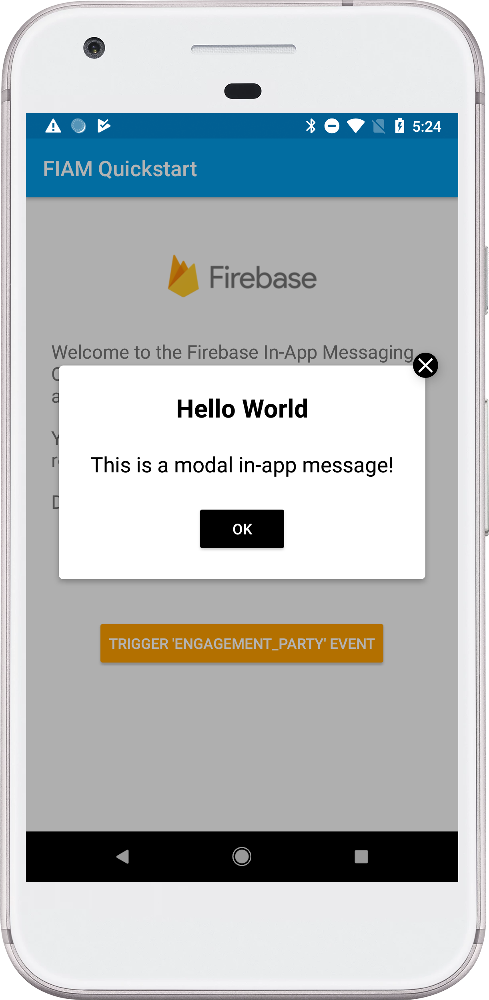

# Firebase In-App Messaging Quickstart

## *THIS APP DEMOS A DEFECT IN FIAM ACTION BUTTONS WHEN THE MESSAGE IS DISPLAYED ON A DEVICE RUNNING ANDROID 11. YOU MUST RUN THIS APP ON AN ANDROID 11 DEVICE IN ORDER TO REPRODUCE THE DEFECT*
When you run this app on an Android 11 device and then send an in-app message with an action button containin an https URL, the button **will not** trigger the url and open the browser. This is because of new security rules in Android 11. Firebase queries for a package to be able to handle the intent it creates, but Package Visibility Queries are not allowed on Android 11. Because of that, the query fails and the Intent is never given to the system to open the URL. For 11, you must add a `<queries>` node to your manifest to get permissions to query for a package. More info in the [Android 11 Documentation](https://developer.android.com/about/versions/11/privacy/package-visibility).

## Introduction

This quickstart demonstrates basic usage of Firebase In-App Messaging.

## Getting Started

  * Follow the instructions to [add Firebase to your Android app][add-firebase-android].
  * In the Firebase console, navigate to the **In-App Messaging** section.
  * Click **New Campaign**
    * In the **Style and content** section, design a campaign using one of the provided layouts (Modal, Image, or Banner),
      then click **Next**.
    * In the **Target** section, enter any campain name and description. In the dropdown, choose to target the app
      you just created, then click **Next**.
    * In the **Scheduling** section, choose any reasonable start and end date. Choose `engagement_party` for the trigger event,
      then click **Next**.
    * In the **Conversion events** tab choose the `ecommerce_purchase` conversion event.
  * **Run** the sample app on your device
    * Press the **Trigger** button to fire the event.

## Result

If you successfully trigger a message, you should see something like this:

[add-firebase-android]: https://firebase.google.com/docs/android/setup
